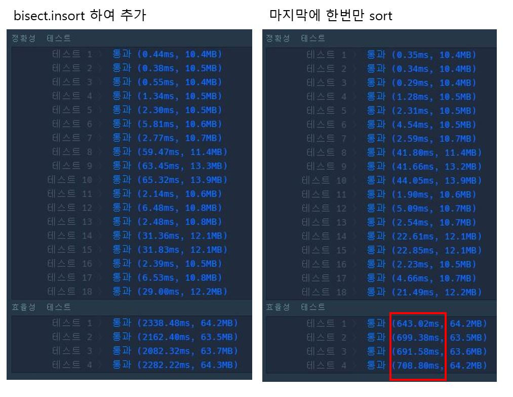
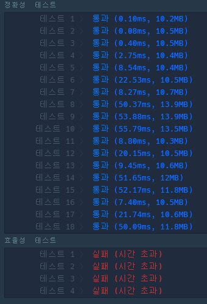

## 프로그래머스 카카오 순위 검색 문제

- 알고리즘 스터디 문제 풀이입니다.

### 문제설명

### 풀이

=======

- [프로그래머스 순위 검색](https://programmers.co.kr/learn/courses/30/lessons/72412) 에서 풀어볼 수 있습니다.

### 문제설명

카카오는 하반기 경력 개발자 공개채용을 진행 중에 있으며 현재 지원서 접수와 코딩테스트가 종료되었습니다. 이번 채용에서 지원자는 지원서 작성 시 아래와 같이 4가지 항목을 반드시 선택하도록 하였습니다.

- 코딩테스트 참여 개발언어 항목에 cpp, java, python 중 하나를 선택해야 합니다.
- 지원 직군 항목에 backend와 frontend 중 하나를 선택해야 합니다.
- 지원 경력구분 항목에 junior와 senior 중 하나를 선택해야 합니다.
- 선호하는 소울푸드로 chicken과 pizza 중 하나를 선택해야 합니다.

인재영입팀에 근무하고 있는 니니즈는 코딩테스트 결과를 분석하여 채용에 참여한 개발팀들에 제공하기 위해 지원자들의 지원 조건을 선택하면 해당 조건에 맞는 지원자가 몇 명인 지 쉽게 알 수 있는 도구를 만들고 있습니다.

예를 들어, 개발팀에서 궁금해하는 문의사항은 다음과 같은 형태가 될 수 있습니다.

```
코딩테스트에 java로 참여했으며, backend 직군을 선택했고, junior 경력이면서,
소울푸드로 pizza를 선택한 사람 중 코딩테스트 점수를 50점 이상 받은 지원자는 몇 명인가?
```

### 풀이

#### ✍ 유림

1. **itertools, bisect 라이브러리 사용**

   1. query 조건을 **key** 로, score list를 **value**로 가지는 딕셔너리를 만든다.
   1. **info 추가** : 딕셔너리에서 info 가 해당되는 모든 조건의 key값에 score를 추가한다.
      - info가 해당되는 조건은 info에서 주어진 각 항목의 값과 '-'의 조합으로 구한다.  
        2^4 = 16 가지의 경우가 있고 itertools 라이브러리의 product를 사용했다.  
         `items = [[lang, '-'],[type, '-'],[career, '-'],[food, '-']] ` <br/>
        `conds = list(map(lambda x: "".join(x), product(*items))) `
      - 처음에는 데이터 추가할 때 bisect.insort 를 사용했는데 두영님 코드를 참고하여 마지막에 sort하는 방법으로 개선했습니다😁
        
   1. **query 검색** : 딕셔너리에서 query에 해당하는 key를 찾는다. value는 점수가 오름차순 정렬되어있는 리스트로, 검색하는 점수의 index를 찾아 전체 리스트 길이에서 빼주면 해당 점수 이상의 점수들 개수를 구할 수 있다. bisect_left 를 이용하면 값이 들어가야할 이전 index를 반환하므로 동일값이 있을 경우에도 적용할 수 있다.

      > 💡 효율성을 위해서 점수조건 이상의 값들을 구할 때, 정렬되어 있는 리스트에서 **이분탐색** 을 이용하는게 중요 포인트

1. **set 의 합집합, 교집합 이용**

   1. score리스트와 각 항목(cpp, java, python, backend, ...)의 집합을 만든다.
   2. info 를 순회하며 해당하는 항목의 집합에 index를 추가한다. 점수는 scores 리스트에 추가한다.
   3. query 조건에 해당하는 교집합을 구한다.
   4. 교집합의 index 값을 scores 리스트에서 확인하여 해당 점수 이상일 경우 개수를 구한다. -> 하나씩 값을 확인해서 효율성 테스트를 통과하지 못한다..

      

#### ✍ 두영

처음에는 트리 dfs로 문제 풀이를 시도했습니다. 하지만 시간 복잡도를 만족시키지 못해 시간초과가 났고, 한참을 고민하다가 검색을 통해 해싱으로 문제 풀이를 한다는 힌트를 얻고 지원자들의 정보들의 조합을 해싱해 리스트에 지원자들의 점수를 저장해놓는 방식으로 문제를 풀이했습니다.

1. 지원자들의 정보 `info`를 받아 0부터 4까지(점수만 제외) 모든 조합을 구해 해싱한다.
2. 키의 값으로 리스트를 주어 각각의 키에 대해 지원자들의 점수를 저장한다.
3. `query`를 순회하며 '-' 값을 제외한 유의미한 값 (ex 'java', 'senior', 'pizza' 등)을 키로 가지는 리스트를 위 해시테이블에서 구해준다.
4. 찾은 리스트에서 일정 점수 이상의 지원자들의 수를 구해준다.

이 때, 시간 복잡도를 위해 각각의 리스트를 미리 정렬해놓고 `query`를 순회하며 이분탐색으로 지원자의 수를 구해주었다.
