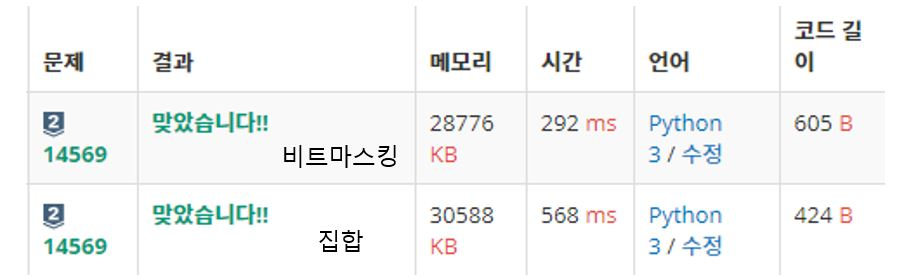

## 백준 #14569 시간표짜기

- 알고리즘 스터디 문제 풀이입니다.
- [백준 14569번](https://www.acmicpc.net/problem/14569) 에서 풀어볼 수 있습니다.

### 문제설명

수업 과목이 진행되는 교시가 t로 주어지고, 학생의 빈 교시가 q로 주어질 때, 각 학생이 들을 수 있는 과목 개수를 출력해라.  

교시 t, q는 다음과 같이 주어진다.  
- 월요일 1 ~ 10교시: 1 ~ 10
- 화요일 1 ~ 10교시: 11 ~ 20
- 수요일 1 ~ 10교시: 21 ~ 30
- 목요일 1 ~ 10교시: 31 ~ 40
- 금요일 1 ~ 10교시: 41 ~ 50

### 풀이

1. 집합 [풀이](./BOJ_14569_yourim_set.py)

2. 비트마스킹 [풀이](./BOJ_14569_yourim_mask.py)

- 비트마스킹 실행 시간이 더 빠르다.   

